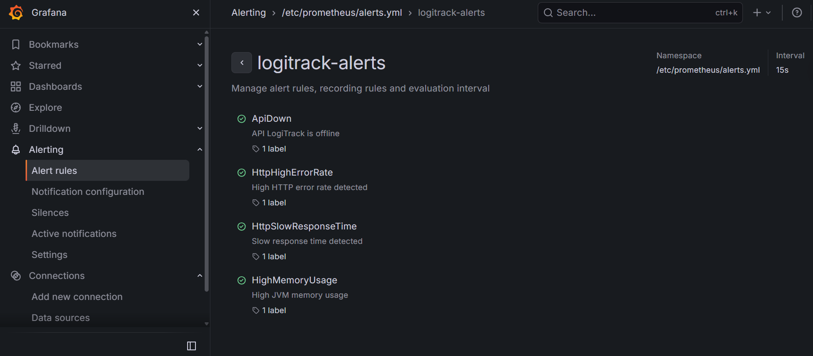
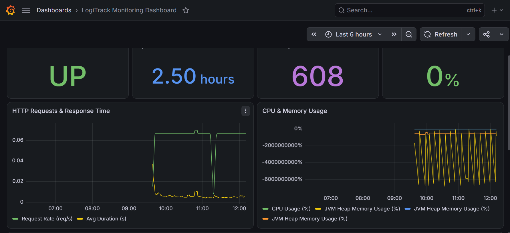
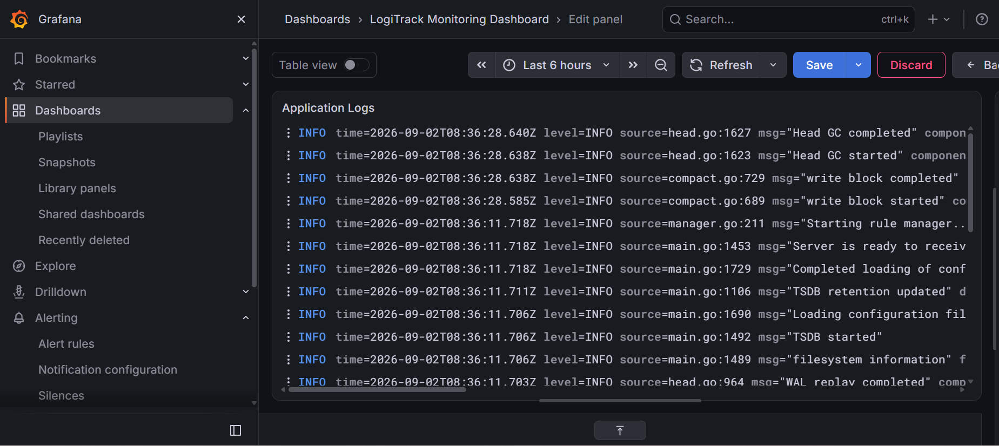

# 🚚 LogiTrack

**LogiTrack** est une application de gestion logistique développée avec **Spring Boot 3**, offrant une API REST sécurisée pour la gestion des commandes, clients, produits et utilisateurs. Elle intègre une pile de monitoring complète basée sur **Prometheus**, **Grafana**, **Loki** et **Grafana Alloy**.

---

## 📋 Table des matières

- [Description du projet](#-description-du-projet)
- [Architecture technique](#-architecture-technique)
- [Technologies utilisées](#-technologies-utilisées)
- [Prérequis](#-prérequis)
- [Démarrage rapide avec Docker Compose](#-démarrage-rapide-avec-docker-compose)
- [Services et ports](#-services-et-ports)
- [Monitoring](#-monitoring)
  - [Spring Boot Actuator](#spring-boot-actuator)
  - [Prometheus](#prometheus)
  - [Grafana](#grafana)
  - [Loki & Grafana Alloy](#loki--grafana-alloy)
  - [Alertmanager](#alertmanager)
- [API Documentation](#-api-documentation)
- [Structure du projet](#-structure-du-projet)

---

## 📦 Description du projet

LogiTrack est une solution backend pour la gestion des opérations logistiques. Elle expose une API REST sécurisée par **JWT** permettant de :

- **Gérer les clients** : création, consultation, mise à jour et suppression.
- **Gérer les produits** : catalogue des produits disponibles.
- **Gérer les commandes** : suivi du cycle de vie des commandes avec leurs lignes de commande.
- **Authentification** : système de connexion sécurisé basé sur JWT avec rôles (`Admin`, `Manager`, `Agent`).

Les migrations de base de données sont gérées automatiquement par **Flyway**, garantissant une cohérence du schéma à chaque démarrage.

---

## 🏗️ Architecture technique

```
┌─────────────────────────────────────────────────────────────┐
│                        Docker Network                        │
│                      logitrack-network                       │
│                                                             │
│  ┌──────────────┐     ┌──────────────┐                      │
│  │   LogiTrack   │────▶│    MySQL     │                      │
│  │  :8081        │     │    :3306     │                      │
│  └──────┬───────┘     └──────────────┘                      │
│         │ /actuator/prometheus                               │
│         ▼                                                   │
│  ┌──────────────┐     ┌──────────────┐     ┌─────────────┐  │
│  │  Prometheus  │────▶│   Grafana    │◀────│    Loki     │  │
│  │    :9090     │     │    :3000     │     │    :3100    │  │
│  └──────┬───────┘     └──────────────┘     └──────▲──────┘  │
│         │                                         │         │
│         ▼                                         │         │
│  ┌──────────────┐                         ┌───────┴──────┐  │
│  │ Alertmanager │                         │ Grafana Alloy│  │
│  │    :9093     │                         │ (log shipper)│  │
│  └──────────────┘                         └──────────────┘  │
└─────────────────────────────────────────────────────────────┘
```

---

## 🛠️ Technologies utilisées

| Technologie              | Version   | Rôle                                        |
|--------------------------|-----------|---------------------------------------------|
| **Java**                 | 21        | Langage de programmation                    |
| **Spring Boot**          | 3.3.4     | Framework applicatif                        |
| **Spring Security + JWT**| -         | Authentification et autorisation            |
| **Spring Data JPA**      | -         | Couche d accès aux données                  |
| **Flyway**               | -         | Migrations de base de données               |
| **MySQL**                | 8.0       | Base de données relationnelle               |
| **MapStruct**            | 1.5.5     | Mapping DTO vers Entité                     |
| **Lombok**               | -         | Réduction du boilerplate Java               |
| **OpenFeign**            | -         | Client HTTP déclaratif                      |
| **Resilience4j**         | -         | Circuit breaker / résilience                |
| **Springdoc OpenAPI**    | 2.5.0     | Documentation API (Swagger UI)              |
| **Micrometer Prometheus**| -         | Export des métriques vers Prometheus        |
| **Spring Actuator**      | -         | Endpoints de monitoring et santé            |
| **Prometheus**           | latest    | Collecte et stockage des métriques          |
| **Grafana**              | latest    | Visualisation des métriques et logs         |
| **Loki**                 | latest    | Agrégation et stockage des logs             |
| **Grafana Alloy**        | latest    | Collecte et envoi des logs vers Loki        |
| **Alertmanager**         | latest    | Gestion des alertes Prometheus              |
| **Docker / Compose**     | -         | Conteneurisation et orchestration           |

---

## ✅ Prérequis

Avant de démarrer le projet, assurez-vous d avoir installé :

- **[Docker Desktop](https://www.docker.com/products/docker-desktop/)** (inclut Docker Compose v2)
- **[Git](https://git-scm.com/)**
- **[Java 21](https://adoptium.net/)** *(uniquement pour le build local)*
- **[Maven 3.8+](https://maven.apache.org/)** *(uniquement pour le build local)*

> **Note :** Sur Linux/macOS, assurez-vous que le daemon Docker est démarré. Sur Windows, utilisez Docker Desktop avec WSL2.

---

## 🚀 Démarrage rapide avec Docker Compose

### 1. Cloner le projet

```bash
git clone <url-du-repo>
cd LogiTrack
```

### 2. Construire le JAR de l application

Avant de lancer Docker Compose, il faut compiler l application pour générer le fichier JAR :

```bash
# Avec le wrapper Maven inclus dans le projet
./mvnw clean package -DskipTests    # Linux / macOS
mvnw.cmd clean package -DskipTests  # Windows
```

> Le JAR sera généré dans le répertoire `target/`.

### 3. Démarrer tous les services

```bash
docker compose up -d
```

Cette commande :
- **Construit** l image Docker de l application (`logitrack`)
- **Démarre** tous les services en arrière-plan : MySQL, LogiTrack, Prometheus, Grafana, Loki, Alloy, Alertmanager

### 4. Vérifier que tous les conteneurs sont en cours d exécution

```bash
docker compose ps
```

### 5. Arrêter les services

```bash
docker compose down
```

Pour supprimer également les volumes (données MySQL) :

```bash
docker compose down -v
```

---

## 🌐 Services et ports

| Service          | URL d accès                                       | Description                        |
|------------------|---------------------------------------------------|------------------------------------|
| **LogiTrack API**| http://localhost:8081                             | API REST principale                |
| **Swagger UI**   | http://localhost:8081/swagger-ui/index.html       | Documentation interactive de l API |
| **Actuator**     | http://localhost:8081/actuator                    | Endpoints de monitoring            |
| **Prometheus**   | http://localhost:9090                             | Interface Prometheus               |
| **Grafana**      | http://localhost:3000                             | Tableaux de bord (admin / admin)   |
| **Loki**         | http://localhost:3100                             | API Loki (logs)                    |
| **Alertmanager** | http://localhost:9093                             | Interface de gestion des alertes   |
| **MySQL**        | localhost:3307                                    | Base de données (root / root)      |

---

## 📊 Monitoring

### Spring Boot Actuator

**Spring Boot Actuator** expose des endpoints HTTP permettant d inspecter et de surveiller l application en temps réel.

Les endpoints exposés sont configurés dans `application.properties` :

```properties
management.endpoints.web.exposure.include=health,info,metrics,prometheus
management.endpoint.health.show-details=always
```

| Endpoint                                | Description                                      |
|-----------------------------------------|--------------------------------------------------|
| `/actuator/health`                      | Etat de santé de l application et ses dépendances|
| `/actuator/info`                        | Informations générales sur l application         |
| `/actuator/metrics`                     | Liste toutes les métriques disponibles           |
| `/actuator/metrics/{nom.metrique}`      | Valeur d une métrique spécifique                 |
| `/actuator/prometheus`                  | Métriques au format Prometheus (scrape endpoint) |

**Exemples d utilisation :**

```bash
# Vérifier la santé de l application
curl http://localhost:8081/actuator/health

# Voir les métriques JVM
curl http://localhost:8081/actuator/metrics/jvm.memory.used

# Voir toutes les métriques exposées
curl http://localhost:8081/actuator/metrics
```

---

### Prometheus

**Prometheus** collecte les métriques de l application toutes les **15 secondes** en scrapant l endpoint `/actuator/prometheus`.

**Configuration** : `monitoring/prometheus/prometheus.yml`

```yaml
scrape_configs:
  - job_name: "logitrack"
    metrics_path: "/actuator/prometheus"
    static_configs:
      - targets: ["logitrack:8081"]
```

**Accès à l interface Prometheus :** http://localhost:9090

**Exemples de requêtes PromQL :**

```promql
# Taux de requêtes HTTP (par seconde)
rate(http_server_requests_seconds_count[5m])

# Utilisation mémoire JVM (heap)
jvm_memory_used_bytes{area="heap"}

# Temps de réponse moyen
rate(http_server_requests_seconds_sum[5m]) / rate(http_server_requests_seconds_count[5m])

# Statut de l application (1 = UP, 0 = DOWN)
up{job="logitrack"}
```

#### Règles d alerte

Les alertes sont définies dans `monitoring/prometheus/alerts.yml` :

| Alerte                 | Condition                                         | Sévérité |
|------------------------|---------------------------------------------------|----------|
| `ApiDown`              | L application est indisponible depuis > 1 min     | critical |
| `HttpHighErrorRate`    | Taux d erreurs HTTP 5xx > 5% depuis > 2 min       | warning  |
| `HttpSlowResponseTime` | Temps de réponse moyen > 1,5s depuis > 2 min      | warning  |
| `HighMemoryUsage`      | Utilisation mémoire JVM Heap > 85% depuis > 2 min | warning  |



---

### Grafana

**Grafana** est l interface de visualisation centrale. Il est pré-configuré automatiquement au démarrage grâce au provisioning.

**Accès :** http://localhost:3000
**Identifiants par défaut :** `admin` / `admin`

#### Datasources préconfigurées

Les sources de données sont automatiquement provisionnées via `monitoring/grafana/provisioning/datasources/datasources.yml` :

| Datasource    | URL                       | Par défaut |
|---------------|---------------------------|------------|
| **Prometheus**| http://prometheus:9090    | Oui        |
| **Loki**      | http://loki:3100          | Non        |

#### Dashboard préconstruit

Un dashboard **LogiTrack** est automatiquement disponible dans Grafana dès le démarrage. Il inclut des panneaux pour :

- Statut de l application (UP/DOWN)
- Taux de requêtes HTTP par endpoint et statut
- Temps de réponse des endpoints
- Utilisation mémoire JVM (heap/non-heap)
- Nombre de threads actifs
- Logs en temps réel (via Loki)

Pour accéder au dashboard :
1. Ouvrir Grafana -> http://localhost:3000
2. Se connecter avec `admin` / `admin`
3. Aller dans **Dashboards** -> **LogiTrack**



---

### Loki & Grafana Alloy

**Loki** est le système d agrégation de logs. **Grafana Alloy** joue le rôle de collecteur de logs : il lit les logs des conteneurs Docker et les envoie vers Loki.

**Architecture des logs :**
```
Conteneurs Docker -> Grafana Alloy -> Loki -> Grafana
```

**Interroger les logs dans Grafana :**
1. Aller dans **Grafana** -> **Explore**
2. Sélectionner la datasource **Loki**
3. Utiliser des requêtes LogQL :

```logql
# Voir tous les logs du conteneur logitrack
{container="logitrack"}

# Filtrer les logs d erreur
{container="logitrack"} |= "ERROR"

# Filtrer par niveau de log
{container="logitrack"} | json | level="ERROR"
```



---

### Alertmanager

**Alertmanager** reçoit les alertes de Prometheus et les achemine vers les destinataires configurés (email, Slack, PagerDuty, etc.).

**Accès :** http://localhost:9093
**Configuration :** `monitoring/alertmanager/alertmanager.yml`

Pour configurer des notifications (ex: email), modifier le fichier `alertmanager.yml` :

```yaml
global:
  smtp_smarthost: 'smtp.example.com:587'
  smtp_from: 'alerts@logitrack.com'

receivers:
  - name: 'default'
    email_configs:
      - to: 'votre-email@example.com'
```

---

## 📖 API Documentation

La documentation interactive de l API est disponible via **Swagger UI** :

http://localhost:8081/swagger-ui/index.html

### Principaux endpoints

| Méthode | Endpoint                  | Description                      | Auth requise |
|---------|---------------------------|----------------------------------|--------------|
| `POST`  | `/api/auth/login`         | Authentification, retourne un JWT| Non          |
| `GET`   | `/api/clients`            | Liste tous les clients           | Oui          |
| `POST`  | `/api/clients`            | Créer un nouveau client          | Oui          |
| `GET`   | `/api/produits`           | Liste tous les produits          | Oui          |
| `POST`  | `/api/produits`           | Créer un produit                 | Oui          |
| `GET`   | `/api/commandes`          | Liste toutes les commandes       | Oui          |
| `POST`  | `/api/commandes`          | Créer une commande               | Oui          |

**Utiliser l API avec JWT :**

```bash
# 1. S authentifier
curl -X POST http://localhost:8081/api/auth/login \
  -H "Content-Type: application/json" \
  -d '{"username": "admin", "password": "password"}'

# 2. Utiliser le token retourné pour les requêtes suivantes
curl http://localhost:8081/api/clients \
  -H "Authorization: Bearer <votre-token-jwt>"
```

---

## 📁 Structure du projet

```
LogiTrack/
├── src/
│   └── main/
│       ├── java/org/example/logitrack/
│       │   ├── LogiTrackApplication.java   # Point d entrée
│       │   ├── controller/                 # Contrôleurs REST
│       │   │   ├── AuthController.java
│       │   │   ├── ClientController.java
│       │   │   ├── CommandeController.java
│       │   │   └── ProduitController.java
│       │   ├── entity/                     # Entités JPA
│       │   │   ├── User.java
│       │   │   ├── Client.java
│       │   │   ├── Commande.java
│       │   │   ├── LigneCommande.java
│       │   │   └── Produit.java
│       │   ├── service/                    # Logique métier
│       │   ├── repository/                 # Repositories JPA
│       │   ├── dtos/                       # Objets de transfert de données
│       │   ├── mapper/                     # MapStruct mappers
│       │   ├── config/                     # Configuration Spring Security
│       │   ├── client/                     # Clients Feign
│       │   └── enums/                      # Enums métier
│       └── resources/
│           ├── application.properties      # Configuration principale
│           ├── db/migration/               # Scripts Flyway
│                     
├── monitoring/
│   ├── prometheus/
│   │   ├── prometheus.yml                  # Configuration Prometheus
│   │   └── alerts.yml                      # Règles d alerte
│   ├── grafana/
│   │   └── provisioning/
│   │       ├── datasources/                # Datasources auto-provisionnées
│   │       └── dashboards/                 # Dashboards auto-provisionnés
│   ├── loki/
│   │   └── loki-config.yml                 # Configuration Loki
│   ├── alloy/
│   │   └── config.alloy                    # Configuration Grafana Alloy
│   └── alertmanager/
│       └── alertmanager.yml                # Configuration Alertmanager
├── Dockerfile                              # Image Docker de l application
├── docker-compose.yml                      # Orchestration des services
└── pom.xml                                 # Dépendances Maven
```

---

## 🐳 Commandes Docker utiles

```bash
# Démarrer tous les services en arrière-plan
docker compose up -d

# Voir les logs de l application
docker compose logs -f logitrack

# Voir les logs de tous les services
docker compose logs -f

# Redémarrer un service spécifique
docker compose restart logitrack

# Arrêter tous les services
docker compose down

# Reconstruire l image et redémarrer
docker compose up -d --build

# Voir l état des conteneurs
docker compose ps
```

---

## 🔧 Configuration

Les variables d environnement importantes du fichier `docker-compose.yml` :

| Variable                     | Valeur par défaut              | Description                         |
|------------------------------|--------------------------------|-------------------------------------|
| `MYSQL_DATABASE`             | `logitrack`                    | Nom de la base de données           |
| `MYSQL_ROOT_PASSWORD`        | `root`                         | Mot de passe MySQL                  |
| `SPRING_DATASOURCE_URL`      | `jdbc:mysql://mysql:3306/logitrack` | URL de connexion MySQL         |
| `SPRING_DATASOURCE_USERNAME` | `root`                         | Utilisateur MySQL                   |
| `SPRING_DATASOURCE_PASSWORD` | `root`                         | Mot de passe MySQL                  |

---

*Projet développé avec Spring Boot 3 · Java 21 · Docker · Prometheus · Grafana · Loki*
